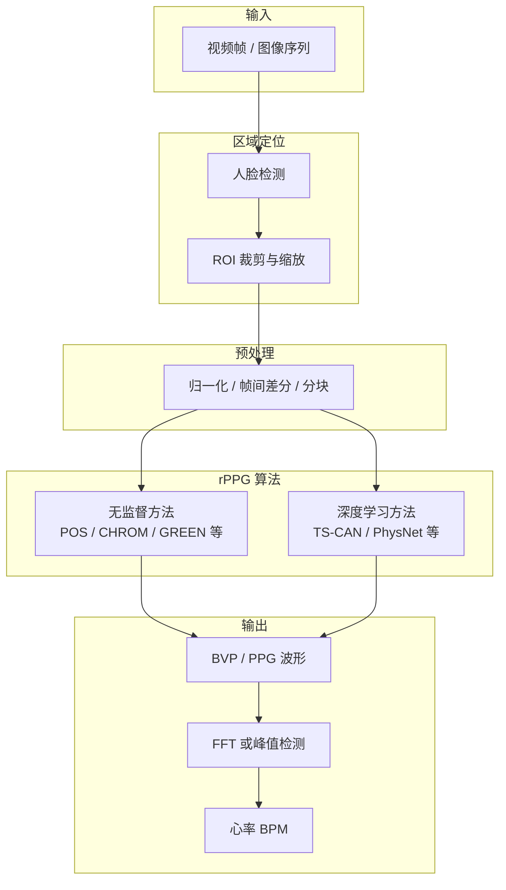
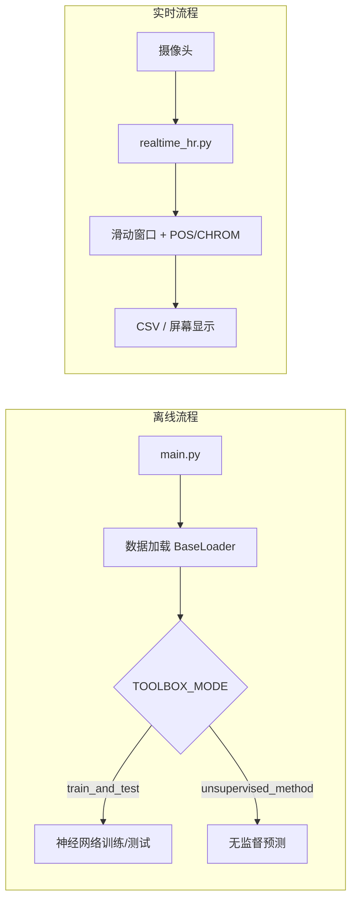
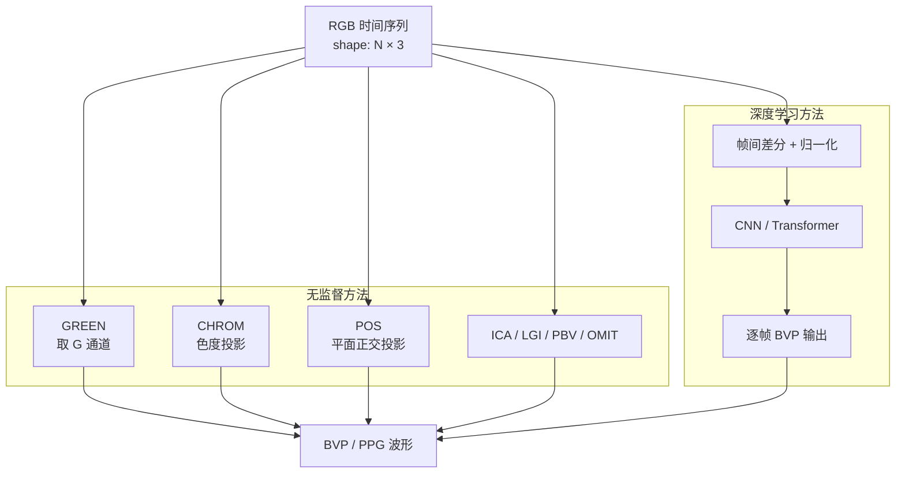
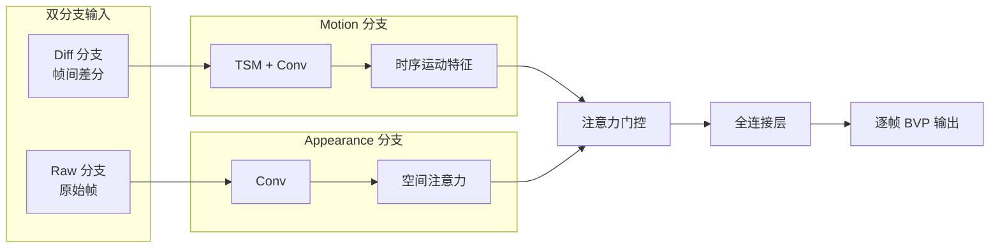
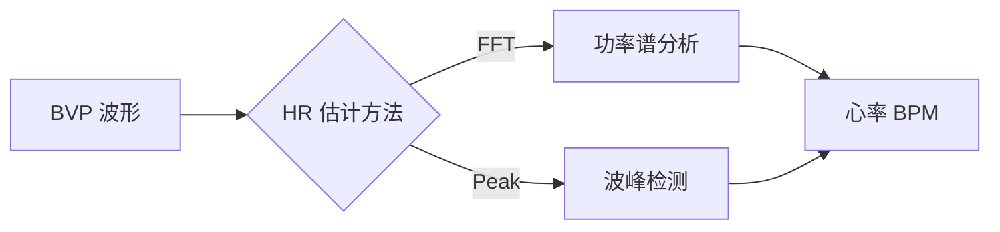
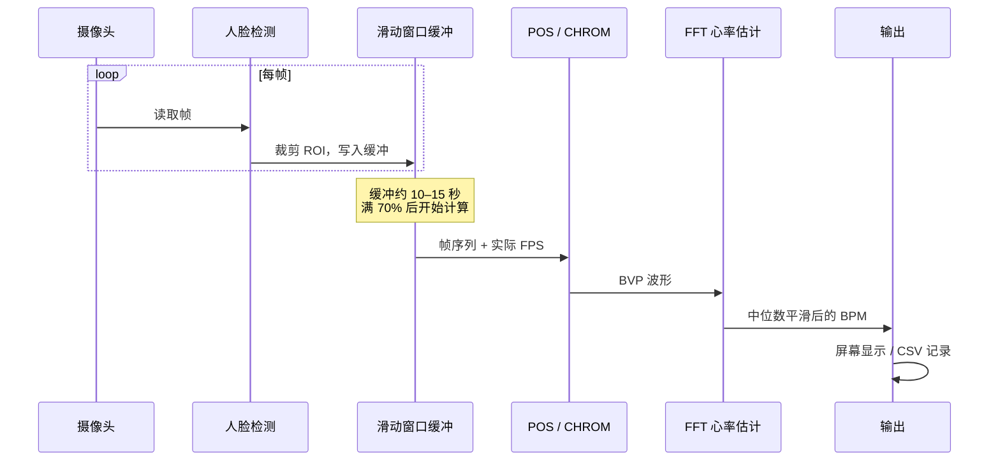
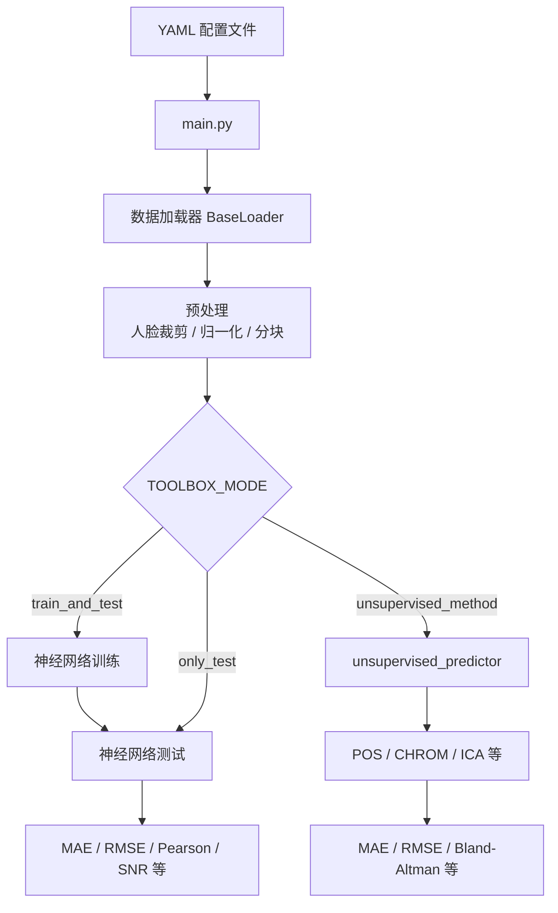

# rPPG-Toolbox 算法逻辑概述

本文档说明 **rPPG-Toolbox** 仓库中远程光电容积脉搏波（Remote Photoplethysmography, rPPG）的整体处理逻辑：如何从摄像头图像/视频中识别测量区域、提取脉搏信号（BVP/PPG），并换算为心率（BPM）。

---

## 1. 核心物理原理

心跳时，每次心搏都会将血液泵入面部微血管，改变皮肤对光的吸收与反射。该变化非常微弱（通常不到像素灰度的 1%），但会随心跳周期重复出现。

摄像头每帧记录的是 RGB 像素值；在固定 ROI（一般是额头/脸颊）上，R/G/B 通道会随血容量发生周期性波动。rPPG 的任务是：**从「RGB 时间序列」中分离出与心跳同频的脉搏成分**。

---

## 2. 整体处理流程



---

## 3. 仓库使用路径

| 路径 | 入口 | 用途 |
|------|------|------|
| 离线 Benchmark | `main.py` + YAML 配置 | 数据集训练/测试、算法对比 |
| 无监督推理 | `unsupervised_methods/` | POS、CHROM 等经典算法 |
| 实时检测 | `realtime_hr.py`、`webcam_hr_websocket_app/` | 摄像头实时心率 |



---

## 4. 第一步：在图像中定位测量区域

算法并不直接在全图搜索脉搏信号，而是先锁定 **人脸 ROI（Region of Interest）**。

### 4.1 人脸检测

`dataset/data_loader/BaseLoader.py` 中的 `crop_face_resize()` 负责离线预处理，支持两种检测后端：

| 后端 | 标识 | 说明 |
|------|------|------|
| Haar Cascade | `HC` | OpenCV 经典检测器，CPU 友好 |
| YOLO5Face | `Y5F` | 基于 WiderFace 训练，复杂场景更鲁棒 |

检测逻辑要点：

- 若检测到多张人脸，取 **最大** 人脸框
- 可选 **动态检测**：每隔 N 帧重新检测，适应头部移动
- 可选 **中位数框**：对多次检测结果取中位数，减少抖动
- 可选 **放大框**：扩大检测框以包含更多额头/脸颊区域

### 4.2 ROI 裁剪与缩放


实时脚本 `realtime_hr.py` 采用相同思路：Haar 检测人脸后，取略小于人脸框的 ROI（偏额头区域），以减少嘴部运动和背景干扰。

---

## 5. 第二步：从 ROI 提取颜色时间序列

无监督算法的共同起点：**对 ROI 内所有像素求 RGB 均值**，将 2D 图像序列压缩为 1D 颜色信号。

```
输入:  N 帧 ROI 图像，每帧 shape = (H, W, 3)
输出:  RGB 矩阵，shape = (N, 3)
       其中 RGB[t] = mean( frame[t][:, :, 0:3] )
```

实现见 `unsupervised_methods/methods/POS_WANG.py` 中的 `_process_video()`：

- 逐帧对 ROI 内像素求 R、G、B 三通道均值
- 得到长度为 N 的三通道时间序列

此后所有 rPPG 算法均在这条 **RGB 时间序列** 上工作。

---

## 6. 第三步：从 RGB 分离脉搏信号（BVP）

仓库提供两大类方法：**无监督（传统信号处理）** 与 **深度学习（端到端）**。



### 6.1 无监督方法

#### GREEN（Verkruysse, 2008）

最简单的 baseline：直接取 **绿色通道均值** 作为 BVP。绿光对血红蛋白吸收较敏感。

#### CHROM（De Haan, 2013）

在滑动窗口（默认 1.6 秒）内：

1. 用窗口内 RGB 均值归一化每帧颜色
2. 构造色度投影：`Xs = 3R - 2G`，`Ys = 1.5R + G - 1.5B`
3. 带通滤波（0.7–2.5 Hz）
4. 按标准差比自适应组合：`S = Xf - α·Yf`，其中 `α = std(Xf) / std(Yf)`

**思路**：脉搏信号与运动/光照干扰分布在不同色度方向，自适应加权可抑制噪声。

#### POS（Wang, 2017）

在 1.6 秒滑动窗口内：

1. 窗口内 RGB 归一化
2. 投影矩阵 `[0,1,-1; -2,1,1]` 映射到两个正交平面
3. 按标准差比融合两路信号
4. 去趋势（detrend）+ 带通滤波（0.75–3 Hz）

**特点**：对头部运动更鲁棒，是 `realtime_hr.py` 的默认算法。

#### 其他无监督方法

| 方法 | 核心思路 |
|------|----------|
| ICA | 独立成分分析，分离脉搏与干扰成分 |
| LGI | 局部群不变性，增强运动鲁棒性 |
| PBV | 血容量脉冲特征签名 |
| OMIT | 无监督流水线，自动选择最优通道组合 |

### 6.2 深度学习方法

使用带 PPG 真值的数据集（UBFC-rPPG、PURE、SCAMPS 等）训练，端到端输出 BVP 序列。

**典型预处理**（`BaseLoader.preprocess()`）：

- 人脸裁剪 → 缩放到固定尺寸
- 可选 **DiffNormalized**：帧间差分，突出微小变化、抑制静态外观
- 按固定长度 **分块（chunk）** 供网络输入

**以 TS-CAN 为例**（`neural_methods/model/TS_CAN.py`）：



其他支持的神经网络：DeepPhys、PhysNet、EfficientPhys、PhysFormer、BigSmall、PhysMamba、RhythmFormer、FactorizePhys、iBVPNet 等，结构各异，目标一致：**视频 clip → BVP 波形**。

---

## 7. 第四步：从 BVP 计算心率

得到 BVP 后，通过 `evaluation/post_process.py` 换算为 BPM。

### 7.1 FFT 频域法（实时常用）

1. 对 BVP 做功率谱估计（periodogram）
2. 在 **0.75–2.5 Hz**（约 45–150 BPM）范围内找功率峰值
3. `HR (BPM) = 峰值频率 × 60`

### 7.2 峰值检测法（时域）

1. 在 BVP 上检测波峰
2. 计算相邻峰值的平均间隔
3. `HR (BPM) = 60 / 平均峰间隔（秒）`



实时脚本额外处理：

- 对最近若干次估计取 **中位数**，平滑跳变
- 限制 HR 在 **40–180 BPM** 合理范围内

---

## 8. 实时检测流程（realtime_hr.py）



关键参数：

| 参数 | 说明 |
|------|------|
| 滑动窗口 | 约 10–15 秒帧缓冲 |
| 启动阈值 | 缓冲满 70% 后开始计算 |
| 默认算法 | POS（可选 CHROM） |
| 输出 | 每秒记录 HR，可导出 CSV |

---

## 9. 离线 Benchmark 流程（main.py）



---

## 10. 关键源码索引

| 模块 | 路径 | 职责 |
|------|------|------|
| 主入口 | `main.py` | 训练/测试/无监督推理调度 |
| 数据预处理 | `dataset/data_loader/BaseLoader.py` | 人脸检测、裁剪、归一化、分块 |
| 无监督算法 | `unsupervised_methods/methods/` | POS、CHROM、GREEN 等 |
| 无监督推理 | `unsupervised_methods/unsupervised_predictor.py` | 批量预测与评估 |
| 神经网络 | `neural_methods/model/` | TS-CAN、PhysNet 等模型定义 |
| 后处理 | `evaluation/post_process.py` | FFT/峰值 HR 估计、SNR 计算 |
| 实时检测 | `realtime_hr.py` | 摄像头实时 POS/CHROM |
| WebSocket 服务 | `webcam_hr_websocket_app/` | 浏览器端实时心率 |

---

## 11. 概念对照表

| 阶段 | 在做什么 | 关键技术 |
|------|----------|----------|
| **识别测量区域** | 找到脸并裁剪 ROI | Haar Cascade / YOLO5Face |
| **提取颜色信号** | 每帧 ROI 的 RGB 均值 | 空间平均 |
| **分离脉搏成分** | RGB → BVP | POS/CHROM（投影+滤波）或神经网络 |
| **得到心率** | BVP → BPM | FFT 或峰值检测 |

---

## 12. 总结

rPPG **并非**在图像中直接「看到」心跳，而是利用 **心跳引起的微弱、周期性肤色变化**：

1. **定位**：人脸检测 → ROI 裁剪
2. **聚合**：每帧 ROI 内 RGB 空间平均 → 颜色时间序列
3. **分离**：色度投影 / 神经网络 → BVP 脉搏波形
4. **估计**：FFT 或峰值检测 → 心率 BPM

无监督方法依赖颜色物理模型与信号处理，无需训练、部署轻量；深度学习方法通过大量标注数据学习更复杂的时空特征，通常精度更高但对数据和算力要求也更大。

---

## 参考

- 项目 README：[README.md](../README.md)
- POS 论文：Wang et al., IEEE TBME, 2017
- CHROM 论文：De Haan & Jeanne, IEEE TBME, 2013
- GREEN 论文：Verkruysse et al., Optics Express, 2008
